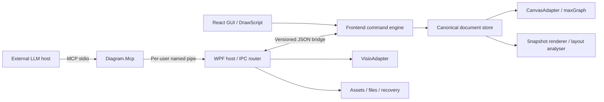

# D1 — Architecture and shared contracts

Author: Codex. Review: Claude reviewed the integrated design and agreed to the
R1–R4 resolutions and final corrections. The decision record is QUESTIONS.md.
Source: spec §§1–4, 19–20, 24–26.

## Choice and alternatives

Retain the supplied Windows-first proposal: .NET 10 WPF with WebView2, React and
TypeScript with maxGraph, OfficeIMO.Visio behind an adapter, and the official C# MCP
SDK in a separate stdio executable. This reduces custom connector/UI work and
keeps the native-file mapping in .NET. These are conditional selections: M0 must
demonstrate the actual required features before production scaffolding.

Two alternatives were considered. An Electron host retains the frontend model and
improves host portability but adds another runtime and backend boundary without
removing the need for Windows acceptance. A native .NET canvas avoids WebView2 IPC
but requires substantially more connector and direct-manipulation work. Neither
offers a clear advantage for this Windows/Visio POC. If a selected library fails M0,
replace the failing adapter rather than rewriting the operation model.

Primary documentation checked during design supports the broad choices:
[maxGraph introduction](https://maxgraph.github.io/maxGraph/docs/manual/),
[OfficeIMO.Visio README](https://github.com/EvotecIT/OfficeIMO/blob/master/OfficeIMO.Visio/README.md),
[C# MCP getting started](https://github.com/modelcontextprotocol/csharp-sdk/blob/main/docs/concepts/getting-started.md)
and [WebView2 security guidance](https://learn.microsoft.com/en-us/microsoft-edge/webview2/concepts/security).
These documents establish available approaches, not compatibility with this POC's
exact mappings. Pin package versions, source commits and licences during M0;
do not invent version numbers or treat advertised round-trip support as acceptance.

## Ownership and data flow

Exactly one frontend store owns an open document's editable canonical state. The
host owns IO, asset bytes, the cross-document asset library and immutable snapshot
conversion. Visio DTOs are transient immutable conversion inputs, never cached as
editable host state. The MCP shim does not
open a separate editable file. maxGraph cells, UI selection and viewport state are
projections, never a second canonical model. All committed GUI/script/MCP mutations
pass through one command queue, including page, layer and document asset catalogue
changes. Host library edits are separate per-user state.

Import parses into a candidate snapshot off the active document. Only after limits,
compatibility review and validation does the host ask the frontend to replace the
open document. Open/recovery gets a new session identity; old queued requests cannot
reach the new document even if the source document UUID is unchanged.

## Module boundaries

| Module | Responsibility | Inputs and outputs |
|---|---|---|
| model | Library-independent schema/invariants | Canonical DTOs and validated snapshots |
| commands | Resolution, planning, atomic commit, history | Mutation request → transaction result |
| script | Parse and compile declarative source | Script → operation batch/source diagnostics |
| canvas | Map snapshots and interpret interactions | DTO projection; GUI intents |
| render/layout | Visual and semantic inspection | Immutable snapshot → revision-labelled result |
| bridge / Diagram.Ipc | Correlation, readiness, session routing | Bounded request/result envelopes |
| Diagram.App | Lifecycle, dialogs, approved paths, dispatch | Host service requests and snapshots |
| Diagram.Visio | Supported native format mapping | DTO snapshot ↔ VSDX plus diagnostics |
| Diagram.Mcp | Provider-neutral tool definitions | MCP tool inputs ↔ application requests |

Use the repository layout in spec §19. Add `contracts/` for the authoritative JSON
Schema bundle and protocol fixtures. Generate TypeScript and C# DTOs where tools
support discriminated unions well; otherwise maintain generated/small mapped DTOs
with schema parity tests. DTO generation does not replace runtime validation.
Reject unknown operation names and patch properties, invalid numbers and mismatched
schema/protocol versions at every external entry boundary.

## Common request contract

Proposed application protocol v1 (internal IPC/bridge, not an alteration of MCP's
own transport): `protocolVersion`, `requestId`, `sessionId`, `documentId`, `method`,
`params`. A handshake establishes capabilities and session identity before requests.
Errors contain `code`, `message`, safe `details` and `requestId`; success includes
the same correlation fields plus `result`. Reads return `documentId`, `sessionId`
and the actual `revision` used. Host lifecycle calls before a document is open use
explicit lifecycle messages, not guessed document identifiers.

Mutations add `baseRevision`, a client-generated `transactionId` and optional batch
`pageId` for alias/name targeting. MCP mutation schemas expose document/session
identity returned by reads; missing session scope is rejected. Resolve IDs
only within the explicit document/page scope. Stage all operations on a candidate
state, including intermediate creations; validate the final state and commit once.
The success result includes previous/current revision, created/changed/deleted
element IDs, changed page/layer/asset IDs, warnings and a UI projection status.
`atomic:false` is unsupported in the MVP rather than enabling partial execution.
`transactionId` is a required client-generated UUID, never generated or substituted
by the shim. These required identity fields refine the source's MCP input examples.

`requestId` correlates transport delivery; `transactionId` deduplicates mutations.
The key is `(sessionId, documentId, transactionId)`, independent of the pipe connection.
At the queue head, validate session/document first, then check the transaction cache,
then check baseRevision. The canonical payload hash includes method, document/session/
page scope, baseRevision and validated normalised params; script requests include
source text rather than generated operations. Exclude requestId, deadline and origin.
A repeated matching transaction returns its original result;
reuse with different content returns `transaction_id_conflict`. Keep a bounded
cache of committed and noChange results. Uncommitted validation rejections are not
cached. FIFO queue-head checking also handles duplicates arriving while the original
is still queued. An expired identifier or a restarted session is not an exactly-once guarantee.
After indeterminate delivery, first retry the identical payload with the same
transactionId while retained. Within the same session reconcile through get_changes
transactionIds, or current state if retained history is unavailable; after a session
change reconcile by current state only before issuing a new mutation identifier.
A successful commit followed by a lost response must not be reported
as a definite rollback.

Minimum error codes: `not_running`, `not_ready`, `no_document`, `session_mismatch`,
`document_mismatch`, `unsupported_version`, `invalid_request`, `not_found`,
`ambiguous_target`, `revision_conflict`, `locked_target`, `limit_exceeded`,
`history_unavailable`, `transaction_id_conflict`, `timeout_unknown`, `io_error`,
`compatibility_loss`, `projection_failed`, `busy`, `busy_user_editing`, `path_not_permitted`,
`consent_denied`, `dependency_conflict`, `method_not_found`, `internal_error`.
Errors include retryable and outcome detail when needed. Errors never imply that a timeout undid
a committed operation. Do not expose raw stack traces or local sensitive paths.

## Request ordering

The frontend queue is the linearisation point. Mutation validation, revision check
and commit happen without awaiting external IO. Asset import is prepared first by
the host; its registration/reference change then commits atomically at the specified
revision. GUI gestures capture a base revision, preview locally and commit at gesture
end. While a human gesture is active, external mutations wait in a bounded admission
gate outside the command queue, for at most 3 s within their overall deadline. The
gate preserves FIFO per connection, including later reads behind a held mutation;
other connections' reads can observe committed state. Gesture commits/cancels always
enter the command queue, so the interlock cannot deadlock the gesture.

On admission recheck document/session only. At the queue head verify scope, check
the transaction cache, then check baseRevision; no admission-time revision check
may bypass the deduplication lookup. A completed human edit makes an uncached older
agent mutation stale; it is not rebased automatically.
After 3 s reject the held mutation with busy_user_editing, retryable true and
outcome not_applied, releasing following requests. Already-admitted mutations can
still invalidate a newly started gesture; discard that preview with a clear status
message as a backstop. Lifecycle barriers explicitly cancel uncommitted gestures.

Semantic reads capture a snapshot after preceding accepted mutations. Rendering
labels that snapshot's revision even if later commits occur during rasterisation.
Save/export takes a snapshot of revision R, completes IO independently and reports R;
if the live store advances, it remains dirty. The host dispatches WebView2 calls on
its UI dispatcher without blocking the UI thread waiting for a pipe response.

Export snapshots also carry a non-canonical projection sidecar with resolved
connector route points, element visual bounds and group visual frames at revision R.
D6 uses it to write native
geometry without the host owning maxGraph. It is not persisted canonical state.
Stale/mismatched sidecars fail export rather than substituting another revision.

## Architectural checks

Cross-language fixtures must validate both request/result schemas. Integration
checks cover two simultaneous callers, stale revisions, document switch during a
queued request, duplicate delivery, partial bridge failure and late render/export
completion. Tests verify adapters cannot mutate public canonical state directly.
